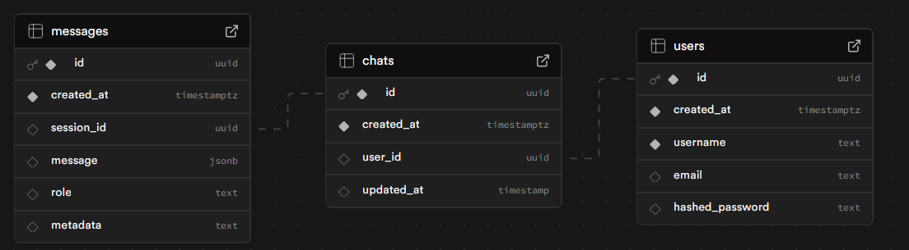

# European Tour Destinations AI App - Backend

This repository contains the backend services for the European Tour Destinations AI App, built with FastAPI. It handles API requests, integrates with AI models (LLMs) for conversational features, manages travel destination data, and persists chat history using Supabase.

---

## Table of Contents
* [Features](#features)
* [Tools & Technologies](#tools--technologies)
* [Getting Started](#getting-started)
    * [Prerequisites](#prerequisites)
    * [Installation](#installation)
    * [Environment Variables](#environment-variables)
    * [Database Setup (Supabase)](#database-setup-supabase)
* [Running Instructions](#running-instructions)
* [API Endpoints](#api-endpoints)
* [License](#license)

---

## Features

* **RESTful API**: Provides endpoints for managing users, chat sessions, messages, and travel destinations.
* **Conversational AI Integration**: Uses an LLM (Large Language Model) to power an AI assistant that provides personalized travel recommendations.
* **Document Retrieval (RAG)**: Integrates with a vector database (ChromaDB, within the application's context) to retrieve relevant information for the LLM.
* **Persistent Chat History**: Stores user conversations in a PostgreSQL database (Supabase) using foreign keys for structured data management.
* **User and Chat Management**: Handles the creation and retrieval of user profiles and individual chat sessions.

---

## Tools & Technologies

* **Web Framework**: FastAPI
* **Language**: Python 3.10+
* **LLM Integration**: OpenAI via LangChain
* **Database**: Supabase (PostgreSQL)
* **Vector Database (for RAG)**: ChromaDB (local persistence, or you can integrate with Supabase's pgvector for advanced use)
* **ORM**: SQLModel (for `users` and `chats` tables)
* **Database Driver**: `psycopg`
* **Dependency Management**: `pip` and `requirements.txt` 

---

## Getting Started

Follow these steps to set up and run the backend.

### Prerequisites

* **Python 3.10+**: Ensure you have Python installed.
* **Docker and Docker Compose**: Essential for running the backend services and the local vector database.
* **An OpenAI API Key**: Required for the LLM integration.
* **A Supabase Project**: You'll need your Supabase project URL and a database connection string. Set up a free project at [Supabase.com](https://supabase.com/).

### Installation

1.  **Clone the repository:**
    ```bash
    git clone [your-backend-repo-url]
    cd [your-backend-repo-directory]
    ```
2.  **Create a Python Virtual Environment** (recommended):
    ```bash
    python -m venv .venv
    source .venv/bin/activate  # On Windows: .venv\Scripts\activate
    ```
3.  **Install dependencies**:
    ```bash
    pip install -r requirements.txt
    ```
    (You might need to create a `requirements.txt` from your current `pip` environment or manually list the installed packages. Key packages include `fastapi`, `uvicorn`, `python-dotenv`, `openai`, `langchain-openai`, `langchain-chroma`, `langchain-community`, `langchain-postgres`, `sqlmodel[asyncpg]`, `psycopg[binary]`.)

### Environment Variables

Create a **`.env`** file in the root of this `api` subdirectory (`/backend/api/.env`). This file will store your sensitive credentials.

```env
AUTH_SECRET_KEY=...
AUTH_ALGORITHM=HS256
API_URL=http://localhost:3000
OPENAI_API_KEY=...
SUPABASE_CONNECTION_STRING=..
SUPABASE_URL=...
SUPABASE_KEY=...

````

### Database Setup (Supabase)

Your backend uses a PostgreSQL database hosted by Supabase. You need to create three tables (`users`, `chats`, `messages`) and set up their relationships.

Here is how the Supabase database schema looks like:



1.  **Go to your Supabase Project Dashboard**: Navigate to the **SQL Editor** section.

2.  **Run the following SQL commands** to create your tables. Ensure you run them in the correct order to satisfy foreign key constraints.

    ```sql
    -- 1. Create the 'users' table
    CREATE TABLE public.users (
      id UUID PRIMARY KEY DEFAULT gen_random_uuid(),
      created_at TIMESTAMPTZ NOT NULL DEFAULT NOW(),
      username TEXT NOT NULL UNIQUE,
      email TEXT NOT NULL UNIQUE,
      -- hashed_password TEXT, -- Uncomment if you're managing passwords directly in this table
      CONSTRAINT users_pkey PRIMARY KEY (id)
    );

    -- 2. Create the 'chats' table
    CREATE TABLE public.chats (
      id UUID PRIMARY KEY DEFAULT gen_random_uuid(),
      created_at TIMESTAMPTZ NOT NULL DEFAULT NOW(),
      user_id UUID NOT NULL REFERENCES public.users(id) ON DELETE CASCADE,
      updated_at TIMESTAMPTZ DEFAULT NOW(),
      title TEXT DEFAULT 'New Chat',
      CONSTRAINT chats_pkey PRIMARY KEY (id)
    );
    -- Index for faster lookups by user_id
    CREATE INDEX idx_chats_user_id ON public.chats (user_id);


    -- 3. Create the 'messages' table
    -- This table is managed by LangChain's PostgresChatMessageHistory.
    -- It expects 'session_id' (which is your chat_id) and a 'message' column of type JSONB.
    CREATE TABLE public.messages (
      id BIGINT GENERATED BY DEFAULT AS IDENTITY PRIMARY KEY, -- Auto-incrementing ID for message order
      created_at TIMESTAMPTZ NOT NULL DEFAULT NOW(),
      session_id TEXT NOT NULL, -- This will store your chat_id UUID as text
      message JSONB NOT NULL,   -- Stores the entire LangChain message object (role, content, metadata)
      CONSTRAINT messages_pkey PRIMARY KEY (id)
    );
    -- Add foreign key constraint to link to the 'chats' table
    ALTER TABLE public.messages
    ADD CONSTRAINT messages_session_id_fkey FOREIGN KEY (session_id) REFERENCES public.chats(id) ON DELETE CASCADE;

    -- Index for faster lookups by session_id (chat_id)
    CREATE INDEX idx_messages_session_id ON public.messages (session_id);
    ```

-----

## Running Instructions

Follow these steps to get your FastAPI backend up and running.

1.  **Create and activate a Python virtual environment**. This isolates your project's dependencies from other projects.

    ```bash
    cd backend
    python -m venv .venv
    source .venv/bin/activate  # On Windows, use: .venv\Scripts\activate
    ```

2.  **Install project dependencies**. This command reads the packages listed in `requirements.txt` and installs them into your virtual environment.

    ```bash
    pip install -r requirements.txt
    ```

3.  **Start the FastAPI server in development mode**. The `fastapi dev` command automatically handles live reloading, so the server will restart whenever you save changes to your code.

    ```bash
    fastapi dev main.py
    ```

Your FastAPI backend will now be running at `http://localhost:8000`. You can access the interactive API documentation at `http://localhost:8000/docs`.

The backend server will typically run on `http://localhost:8000`. You should see output in your terminal indicating that Uvicorn is running.

-----

## API Endpoints

Once the backend is running, you can interact with its API endpoints:
  * **User Management**:
      * `POST /users/`: Create a new user.
      * `GET /users/{user_id}`: Get user details.
  * **Chat Interaction**:
      * `POST /chat/`: Send a new message, get an AI response.
      * `GET /chat/{chat_id}`: Retrieve a specific chat's history.
  * **Chat Session Management**:
      * `POST /chats/`: Create a new chat session for a user.
      * `GET /users/{user_id}/chats/`: List all chat sessions for a user.
  * **Destination Management**:
      * `GET /destinations/destinations`: Fetch all travel destinations.
      * `POST /destinations`: Create a new travel destination.

-----

## License

This project is licensed under the GNU GPL v3.0. See [LICENSE](https://www.google.com/search?q=LICENSE) for details.

